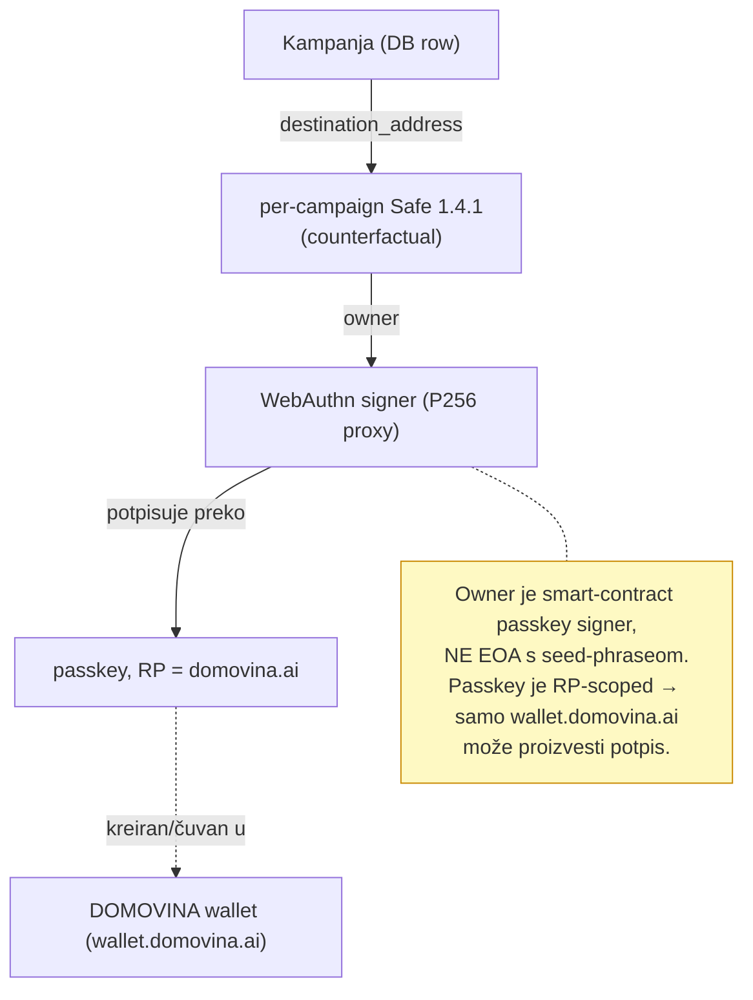
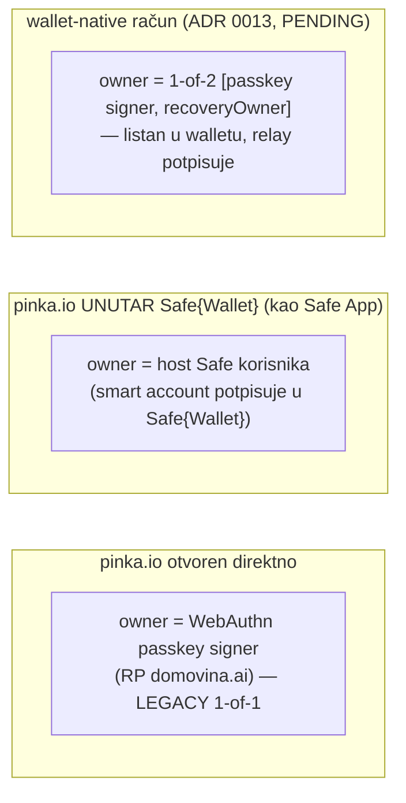
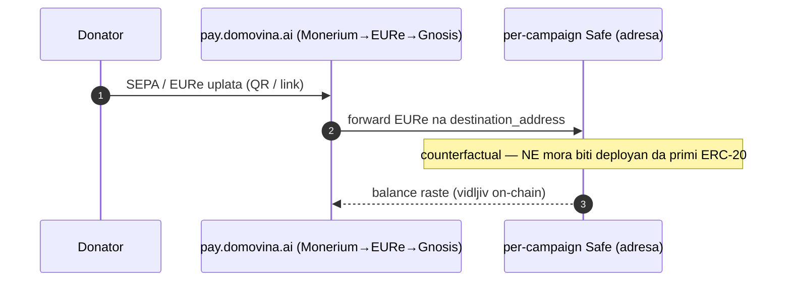
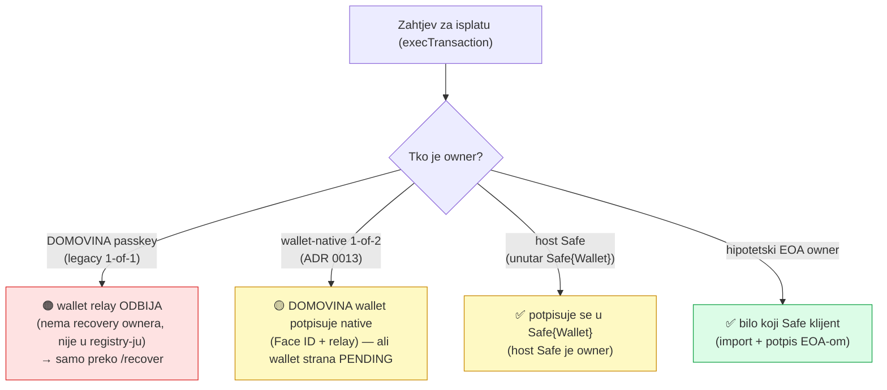
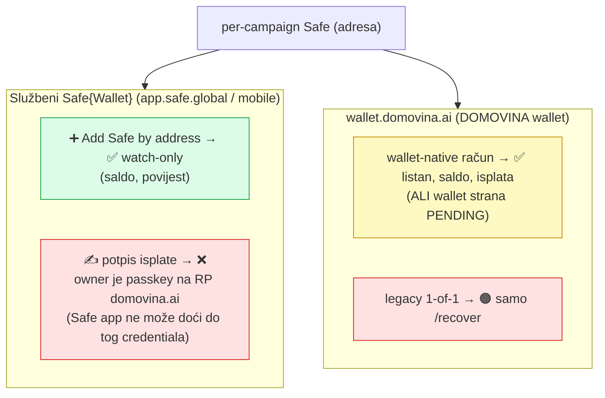
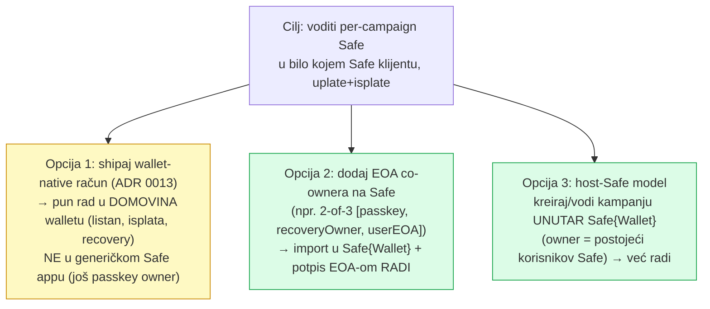
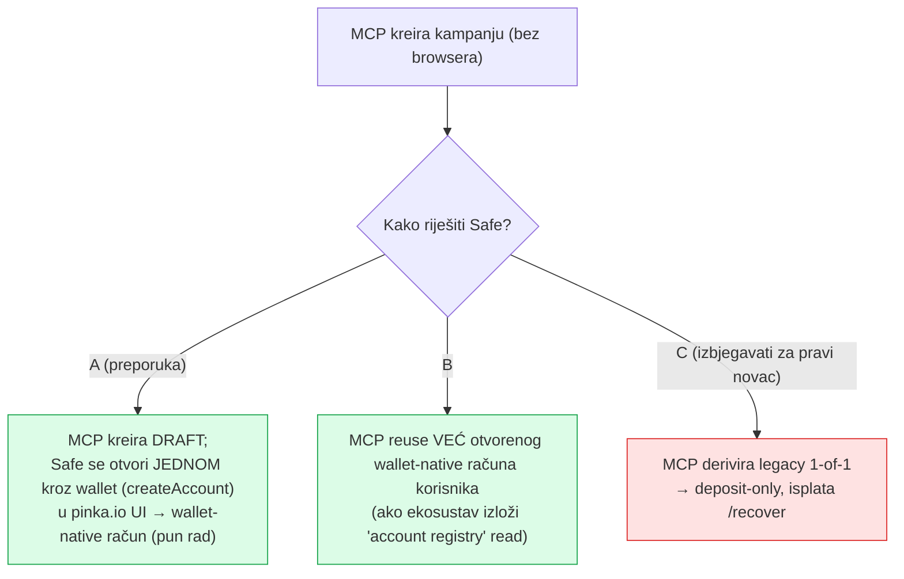

# Per-campaign Safe — vlasništvo, uplate/isplate i prenosivost u Safe klijente

> Odgovara na pitanje: *je li per-campaign Safe dodatni sloj komplikacije, i može
> li ga korisnik jednostavno importati u **wallet.domovina.ai** ili **Safe Mobile
> app** i normalno raditi uplate/isplate kao s bilo kojim multisig Safe-om — radi
> li to već ili treba dorada?*
>
> Datum: 2026-06-26. Izvori: `app/lib/chain/{safe,passkey,walletSdk,safeApp,constants}.ts`,
> `app/docs/wallet-campaign-account-handoff.md` (ADR 0013). Veže se na
> [`mcp-pinka-remote-plan.md`](mcp-pinka-remote-plan.md) §5.

---

## 1. Kratki odgovor (TL;DR)

| Radnja | Status danas | Zašto |
|---|---|---|
| **Uplata** (primanje EURe) | ✅ **radi odmah** | Safe je samo adresa; rail forwarda EURe; counterfactual Safe ne treba ni biti deployan da primi |
| **Isplata kroz DOMOVINA wallet** — *novi* wallet-native račun | 🟡 **dizajnirano, wallet strana NIJE shippana** | 1-of-2 račun, listan u walletu, relay potpisuje (ADR 0013) |
| **Isplata kroz DOMOVINA wallet** — *legacy* 1-of-1 (što pinka/MCP danas deriviraju) | 🟠 **samo preko `/recover`** | "nevidljiv u walletu, relay odbija potpis, nema recovery ownera" |
| **Import + isplata u službenom Safe{Wallet} (mobile/web)** | ❌ **ne kao sada** | owner je **passkey vezan na RP `domovina.ai`** — Safe app ga ne može koristiti (WebAuthn je RP-scoped); nije EOA |
| **Watch-only "add Safe by address" u Safe{Wallet}** | ✅ moguće | bilo koji deployani Safe se može gledati (saldo/povijest), ali bez potpisa |

**Zaključak:** uplate su trivijalne i rade. "Normalno voditi kao svaki multisig u
bilo kojem Safe klijentu" **traži doradu** — i ta je dorada već **dizajnirana**
(wallet-native račun), ali **wallet strana je pending**. Za rad u **bilo kojem**
(ne-DOMOVINA) Safe klijentu treba **EOA owner**, jer passkey nije prenosiv izvan
svog RP-a.

---

## 2. Što je per-campaign Safe i tko je vlasnik

Per-campaign Safe = counterfactual (CREATE2-predviđena) Gnosis Safe 1.4.1 adresa,
`saltNonce = keccak256("pinka:campaign:{id}")`, **owner = korisnikov signer**. Ništa
se ne deploya pri kreiranju; Safe se inicijalizira on-chain **lijeno na prvoj isplati**.

Ključno: **owner NIJE EOA** — to je **WebAuthn passkey signer** (P256), preko Safe
WebAuthn signer factoryja + verifiera. Passkey je vezan na **RP `domovina.ai`**.

### Tri runtime konteksta (tko je točno owner)

---

## 3. Uplata (deposit) — radi danas, bez ikakvog importa

Uplata ne traži da Safe bude importan, deployan ni potpisan. To je "samo adresa".
Per-campaign odvajanje je ovdje **prednost** (čista knjiga po kampanji), ne teret.

---

## 4. Isplata (withdrawal) — ovdje je sva kompleksnost

Isplata = `execTransaction` na Safe-u → **treba potpis ownera**. Tko može potpisati
ovisi o tome **koji** je owner (vidi §2). Safe se pritom prvi put i deploya (relay).

---

## 5. "Import u Safe Mobile app i normalno raditi" — precizno po klijentu

**Zašto baš tako:** WebAuthn credentiali su **vezani na Relying Party (domen)**.
Passkey je kreiran pod `domovina.ai`, pa samo stranice tog RP-a (DOMOVINA wallet)
mogu tražiti potpis. Službeni Safe app radi pod svojim RP-om (`app.safe.global`) i
**ne može** koristiti taj passkey — iako su Safe WebAuthn signer kontrakti standardni.
Zato: gledati da, potpisati ne.

---

## 6. Legacy 1-of-1 vs wallet-native — usporedba

| | Legacy 1-of-1 (danas; pinka derive + MCP derive) | Wallet-native (ADR 0013; **pending**) |
|---|---|---|
| Owners | `[passkey signer]` | `[passkey signer, recoveryOwner]` (1-of-2) |
| U wallet listi računa | ❌ nevidljiv | ✅ listan kao zaseban "račun" |
| Isplata | 🟠 samo `/recover` | ✅ native (relay potpis) |
| Recovery / cross-device | ❌ nema recovery ownera | ✅ recovery owner + backend registry |
| Tko derivira | pinka klijent / **MCP server** (bez browsera) | **wallet** (full-page handoff `createAccount`) |
| Import u generički Safe app + potpis | ❌ | ❌ (i dalje passkey owner) |

> MCP (remote, bez browsera) može derivirati **samo legacy 1-of-1** — dakle baš
> varijantu s gornjim ograničenjima. To je glavna implikacija za `mcp.pinka.io`
> (vidi §8).

---

## 7. Što treba doraditi da bude "kao normalan Safe u bilo kojem klijentu"

- **Opcija 1 (preporuka za DOMOVINA ekosustav):** dovrši wallet `createAccount`
  handoff — pinka strana je već shippana (feature-detect + fallback). Time
  per-campaign račun postaje first-class u walletu (uplate+isplate, recovery,
  cross-device). I dalje nije za generički Safe app, ali za korisnika "izgleda i
  radi kao zaseban bankovni račun".
- **Opcija 2 (za pravu prenosivost):** Safe dobije i **EOA ownera** kojeg korisnik
  drži (seed/hardware). Tek tad ga može importati u **bilo koji** Safe klijent i
  potpisati. Trošak: korisnik mora imati/čuvati EOA (manje "bez-seed" UX).
- **Opcija 3 (već radi):** kad je pinka učitana unutar Safe{Wallet}, host Safe je
  owner → isplate se potpisuju normalno u Safe{Wallet}u. Ograničenje: kreiranje teče
  iz tog konteksta.

---

## 8. Implikacija za remote MCP (`mcp.pinka.io`)

Remote MCP nema browser/passkey → može **samo legacy 1-of-1 derive** (§6). To znači
da bi MCP-kreirane kampanje naslijedile baš ograničenja iz §4/§5 (orphan Safe,
isplata samo `/recover`). To **profinjuje** odluku iz remote plana §5 ("MCP derivira
iz pohranjenog signera"):

**Preporuka:** MCP **ne** kuje orphan 1-of-1 Safeove za stvarni novac. Umjesto toga:
MCP radi sav sadržaj kampanje programski, a **provizija Safe-a ostaje wallet-native**
(otvori se jednom u walletu; MCP je samo referencira). Time se i poklapa s vizijom
"UI i MCP rade istu stvar" — jer i UI Safe dobiva kroz isti wallet handoff.

> To znači da §5 remote plana (pohrani ecosystem signer → MCP derivira) treba
> zamijeniti/nadopuniti s: pohrani/registriraj **wallet-native account adresu**
> korisnika (ili per-kampanju otvoren račun), a ne sirovi signer za 1-of-1 derive.

---

## 9. Sažetak

- **Uplate rade danas** — per-campaign Safe je samo odredišna adresa; counterfactual
  je dovoljan; odvajanje po kampanji je prednost.
- **Isplate / "vođenje kao normalan multisig" traže doradu.** Owner je passkey vezan
  na RP `domovina.ai`, ne EOA → **službeni Safe app ne može potpisati** (može samo
  watch-only). U **DOMOVINA walletu** to postaje pun račun tek kad se shipa
  wallet-native `createAccount` (ADR 0013, **pending**); legacy 1-of-1 je dotad samo
  `/recover`.
- **Za pravu prenosivost u bilo koji Safe klijent** treba **EOA owner** (Opcija 2).
- **Za MCP**: ne raditi orphan 1-of-1; Safe neka ostane wallet-native (otvoren jednom
  kroz wallet), MCP ga samo referencira.
