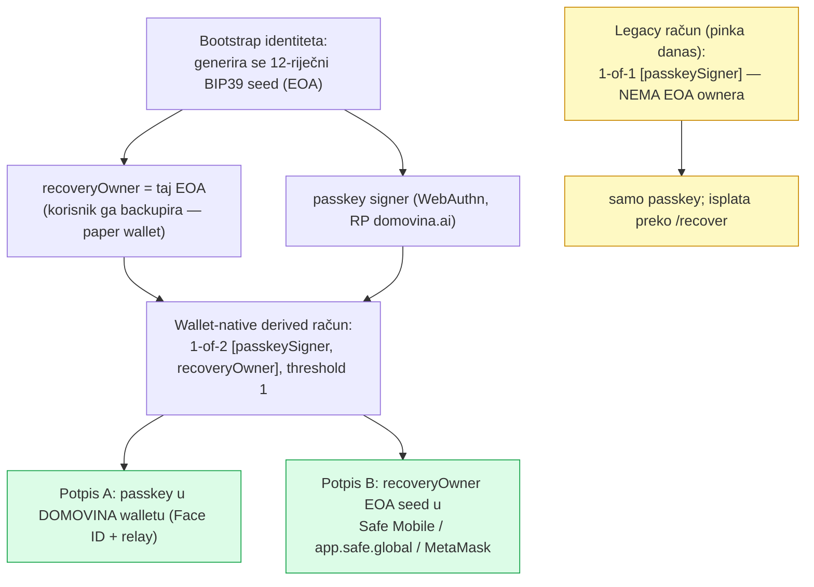
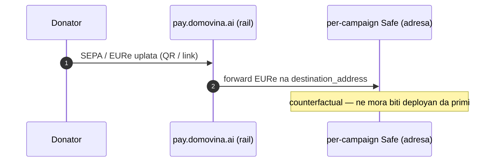
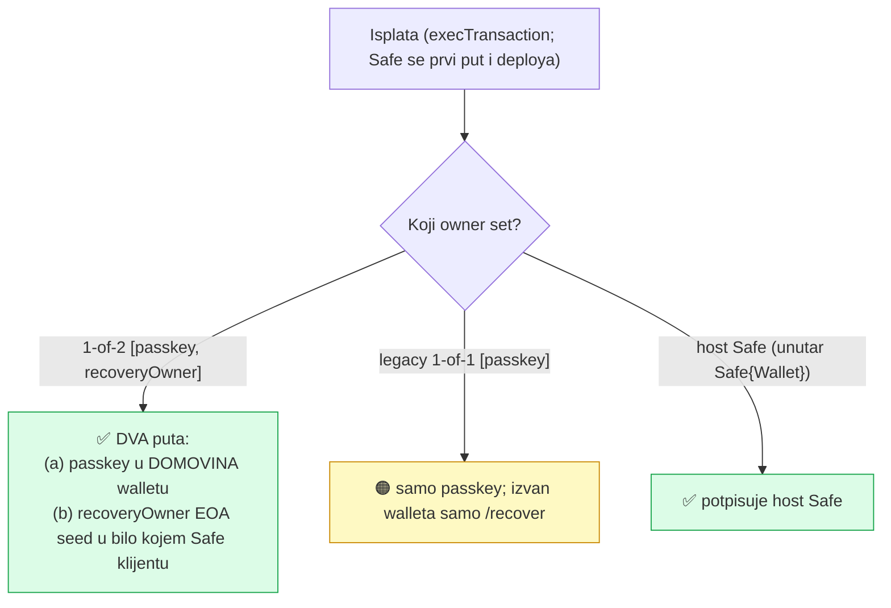
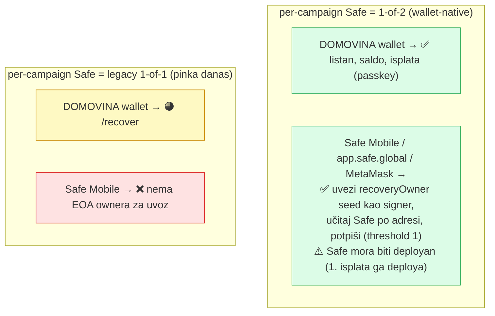
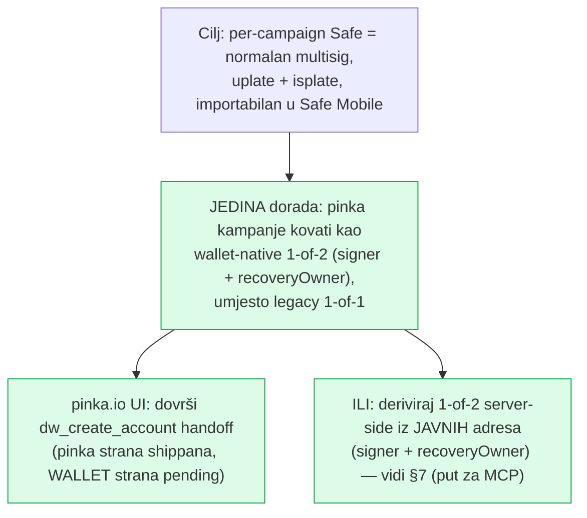
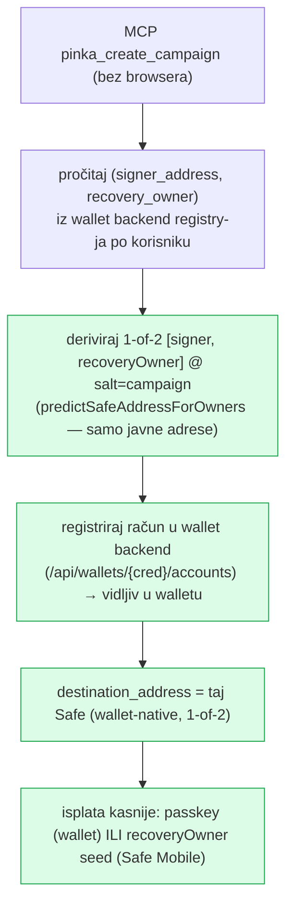

# Per-campaign Safe — vlasništvo, uplate/isplate i prenosivost u Safe klijente

> Odgovara na pitanje: *je li per-campaign Safe dodatni sloj komplikacije, i može
> li ga korisnik jednostavno importati u **wallet.domovina.ai** ili **Safe Mobile
> app** i normalno raditi uplate/isplate kao s bilo kojim multisig Safe-om — radi
> li to već ili treba dorada?*
>
> Datum: 2026-06-26 (REV 2 — ispravljeno nakon uvida da je `recoveryOwner`
> korisnikov EOA). Izvori: `app/lib/chain/{safe,passkey,walletSdk,safeApp}.ts`,
> `pay.domovina.ai/wallet/src/lib/{accounts,bootstrap,paperWallet,registry,recover}.ts`,
> `app/docs/wallet-campaign-account-handoff.md` (ADR 0011/0012/0013). Veže se na
> [`mcp-pinka-remote-plan.md`](mcp-pinka-remote-plan.md) §5.

---

## 1. Kratki odgovor (TL;DR) — ISPRAVAK

**Da, tvoja intuicija je točna:** wallet-native račun je **1-of-2 `[passkeySigner,
recoveryOwner]`**, gdje je `recoveryOwner` **korisnikov bootstrap EOA** = standardni
12-riječni BIP39 seed koji korisnik backupira (ADR 0012). Threshold = 1, pa **taj EOA
sam potpisuje**. `paperWallet.ts` doslovno upućuje: *uvezi seed u Safe Mobile /
app.safe.global / MetaMask kao potpisnika i učitaj Safe po adresi.*

| Radnja | Status | Bitna kvaka |
|---|---|---|
| **Uplata** (primanje EURe) | ✅ radi odmah | Safe je samo adresa; counterfactual prima ERC-20 |
| **Import EOA seeda u Safe Mobile + isplata** — Safe je **1-of-2** (wallet-native) | ✅ **radi po dizajnu** | recoveryOwner = korisnikov BIP39 seed; threshold 1 → potpisuje sam (nakon što je Safe deployan) |
| **Isto, ali Safe je _legacy 1-of-1_** (što pinka/MCP danas deriviraju) | ❌ / 🟠 | 1-of-1 nema EOA ownera — nema što importati; isplata samo `/recover` |
| **Pinka kampanje danas su 1-of-2?** | ❌ **još ne** | pinka derivira legacy 1-of-1; wallet-native handoff (`dw_create_account`) je **pending** |
| **Wallet-native računi (npr. tvoji "računi" u DOMOVINA walletu) danas su 1-of-2?** | ✅ da | `deriveAccount` već radi 1-of-2; mehanizam je živ |

**Sažeto:** mehanizam koji opisuješ **postoji i radi danas** — za **wallet-native
1-of-2 račune**. Jedino što fali: **pinka kampanje se još kuju kao legacy 1-of-1**,
a ne kao 1-of-2. Kad kampanjski Safe postane 1-of-2 (signer + tvoj recovery EOA),
uvoz seeda u Safe Mobile i isplata rade točno kako si zamislio.

---

## 2. Vlasnički model (ADR 0011/0012/0013)

Dva načina (`bootstrap.ts`):
- **'swap'** → owners=`[passkey]` (1-of-1, EOA uklonjen) — *legacy, passkey-only*.
- **'add'** → owners=`[passkey, EOA]` (1-of-2) — *"12-riječni EOA mnemonic postaje
  MetaMask / app.safe.global-kompatibilan"*. Ovo je put koji daje prenosivost.

Svi derivirani računi identiteta **dijele isti recoveryOwner** → korisnik backupira
**JEDAN** ključ koji kontrolira sve (ADR 0013, Decision 2). Address derivacija treba
samo **javne adrese** `[signer, recoveryOwner]` + saltNonce — **ne treba seed**.

---

## 3. Uplata (deposit) — radi danas, bez importa

---

## 4. Isplata (withdrawal) — tko može potpisati

---

## 5. "Import u Safe Mobile i normalno raditi" — po klijentu

> Jedina nijansa za generički Safe klijent: učitavanje Safe-a "po adresi" traži da je
> **deployan** (ima on-chain kod). Counterfactual Safe se deploya na prvoj isplati
> (relay) — nakon toga ga Safe Mobile vidi i EOA potpisuje normalno.

---

## 6. Što treba doraditi (manje nego što se činilo)

Prenosivost u Safe Mobile **NE traži novi sloj** — wallet-native 1-of-2 *već* ima
korisnikov EOA kao drugog ownera. Treba samo da kampanjski Safe bude 1-of-2, ne 1-of-1.

---

## 7. Implikacija za remote MCP — sad bolja vijest

Adresa 1-of-2 Safe-a ovisi samo o **javnim adresama** `[signerAddress, recoveryOwner]`
+ saltNonce. Oboje su **pohranjeni u backend registry-ju** (`/api/wallets`:
`signer_address`, `recovery_owner`). Dakle **MCP može server-side derivirati i
registrirati ispravan wallet-native 1-of-2 kampanjski Safe — bez browsera, passkey-a
ili seeda** (seed treba tek za POTPIS isplate, koji radi korisnik kasnije).

**Ovo zamjenjuje §5 remote plana:** umjesto "pohrani signer → MCP derivira 1-of-1",
ide **"pročitaj (signer, recoveryOwner) iz registry-ja → MCP derivira+registrira
1-of-2"**. Rezultat: MCP-kreirane kampanje su odmah pun wallet-native račun —
uplate, isplate (passkey ili EOA seed), recovery, cross-device, importabilne u Safe
Mobile. Bez orphan 1-of-1.

> Preduvjet: backend registry mora izložiti read `(signer_address, recovery_owner)`
> po korisniku/identitetu MCP-u (interni endpoint ili direktan PG read). To je mala
> dorada na rail/registry backendu.

---

## 8. Sažetak (REV 2)

- **Uplate rade danas.**
- **Prenosivost u Safe Mobile RADI po dizajnu — za 1-of-2 račune.** recoveryOwner je
  korisnikov BIP39 seed (1-of-2, threshold 1); paper wallet doslovno upućuje na uvoz
  u Safe Mobile / app.safe.global / MetaMask. Jedini uvjet: Safe deployan (1. isplata).
- **Jedina dorada:** pinka kampanje kovati kao **wallet-native 1-of-2**, ne legacy
  1-of-1. (wallet `dw_create_account` strana je pending; ALI MCP to može i server-side.)
- **MCP**: derivira+registrira 1-of-2 iz javnih adresa `(signer, recoveryOwner)` iz
  registry-ja → kampanjski Safe je odmah pun, prenosiv, recoverable račun.
