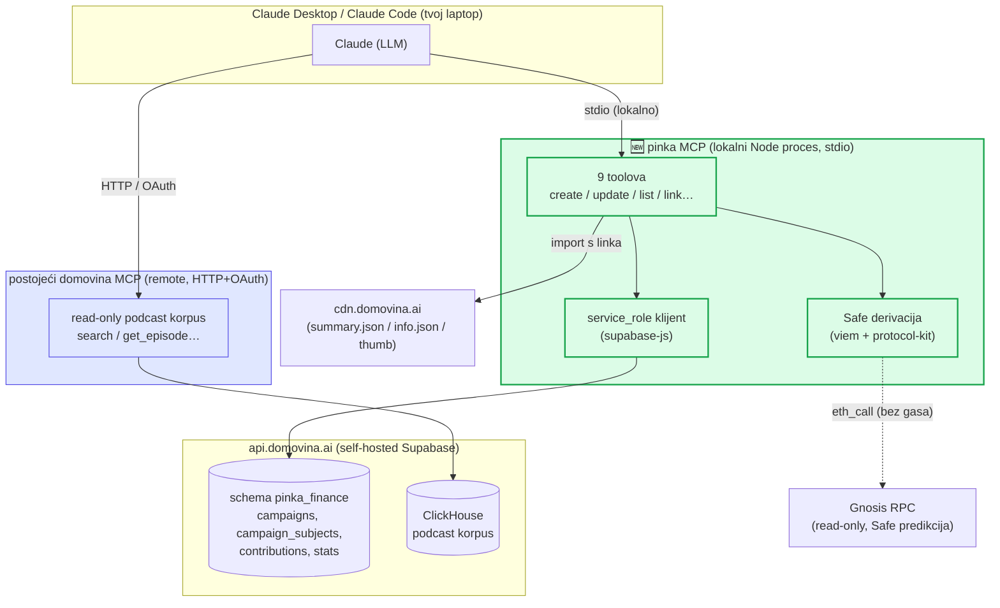
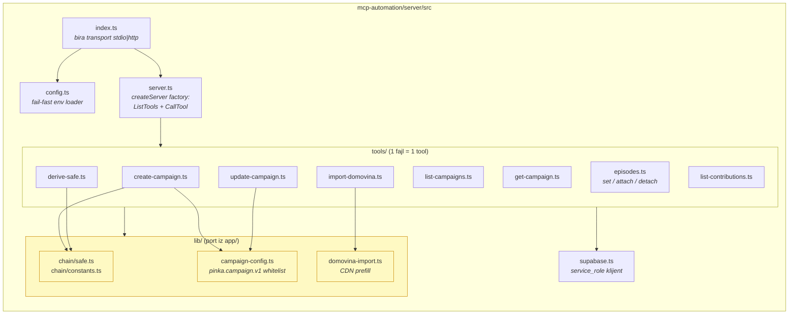
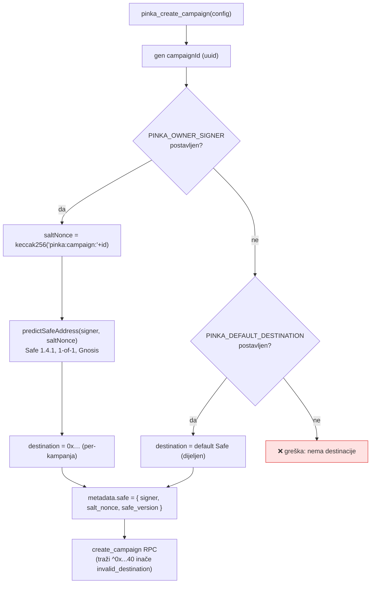
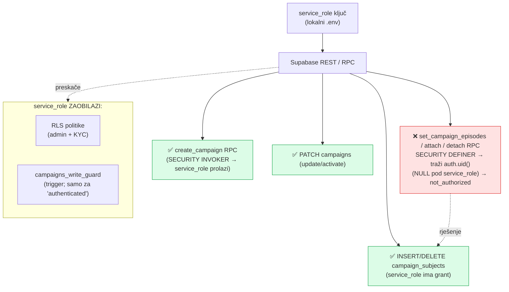
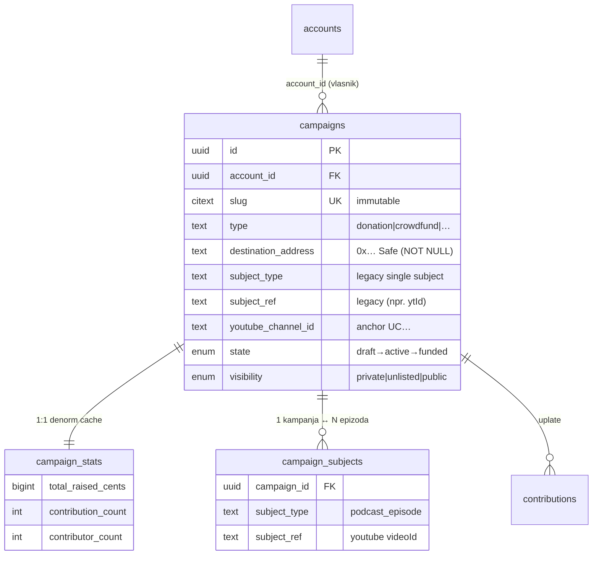
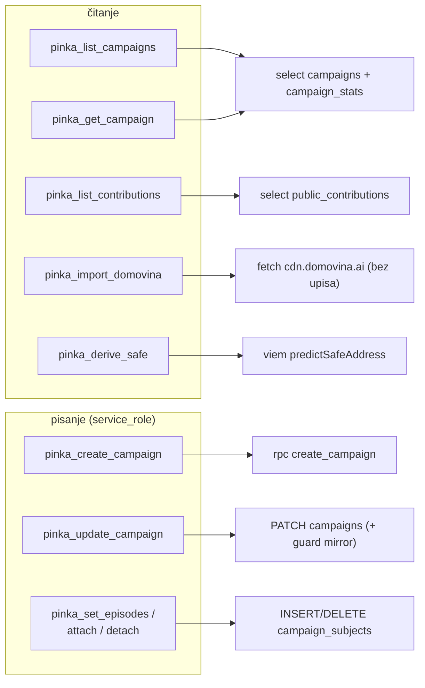

# `mcp.pinka.io` — implementacijski plan (vizualni)

> Osobni admin alat: kreiranje i uređivanje pinka.finance kampanja izravno iz
> Claude Desktopa / Claude Codea, preko dijeljenog Supabasea (`api.domovina.ai`,
> schema `pinka_finance`).
>
> Status: **dizajn dovršen, kreće implementacija.** Datum: 2026-06-26.
> Nadograđuje [`auth-design.md`](auth-design.md) (ADR-0001) i
> [`mcp-a2a-design.md`](mcp-a2a-design.md). Odluke iz ovog dokumenta gaze starije
> gdje se razilaze (vidi §9).

---

## 1. Odluke (potvrđeno s vlasnikom)

| Pitanje | Odluka | Zašto |
|---|---|---|
| Transport + auth | **Lokalni stdio MCP + `service_role`** | Ključ nikad ne napušta tvoje računalo; blast-radius = laptop; najjednostavnija custody. HTTP/remote dolazi kasnije istim codebaseom. |
| Safe (destinacija) | **Podrži oba**: deriviraj per-kampanju iz `PINKA_OWNER_SIGNER`; inače fallback `PINKA_DEFAULT_DESTINATION` | Fleksibilno; default put garantira da su sredstva uvijek povrativa. |
| Uzor | **Zrcali `domovina-rag/services/mcp`** (Node `@modelcontextprotocol/sdk`, ne Cloudflare) | Isti SDK, ista struktura, isti tool obrazac; promocija na HTTP = dodaj njihovu granu. |

---

## 2. Gdje sjedi u sustavu

Pinka MCP je **drugi, write-orijentiran** MCP pokraj postojećeg read-only podcast MCP-a.
Dijele isti SDK i obrasce, ali **različite backende i transporte**.



**Ključna razlika prema podcast MCP-u:** podcast MCP je remote (Coolify), OAuth-gated,
**čita** ClickHouse. Pinka MCP je lokalni stdio, drži `service_role` (god-mode),
**piše** u `pinka_finance`. Zato odvojeni proces — odvojen blast-radius, odvojen audit.

---

## 3. Moduli servera (zrcalo `domovina-rag/services/mcp`)



Svaki tool fajl izvozi (točno kao u podcast MCP-u): `XInput` (zod) + `xJsonSchema`
(ručni JSON schema za `inputSchema`) + `async x(args, deps)` impl. `server.ts` radi
`safeParse` → poziv → `{ content: [{type:"text", text: JSON.stringify(...) }] }`
ili `{ isError: true }`. Logovi idu na **`console.error` (stderr)** jer stdout
nosi MCP protokol.

`lib/` su **portovi provjerene app logike** (ne izmišljam): `chain/safe.ts`,
`campaign-config.ts`, `domovina-import.ts` — identično ponašanje kao web dashboard.

---

## 4. Glavni tok — kreiranje i objava kampanje (e2e)

Ovo je točan slijed koji izvodi `pinka_create_campaign` → link → aktivacija →
verifikacija (i ono što radi e2e test za epizodu `b-nls1ck8EE`).

```mermaid
sequenceDiagram
    autonumber
    participant U as Ti (Claude)
    participant M as pinka MCP
    participant SF as Safe lib (viem)
    participant G as Gnosis RPC
    participant DB as Supabase (service_role)

    Note over U,M: "Napravi donacijsku kampanju za epizodu b-nls1ck8EE, cilj 5000 €"

    opt prefill s domovina linka
        U->>M: pinka_import_domovina("domovina.ai/v/b-nls1ck8EE")
        M->>M: fetch CDN summary.json / thumbnail
        M-->>U: pinka.campaign.v1 nacrt (bez upisa)
    end

    U->>M: pinka_create_campaign(config)
    M->>M: gen uuid + validacija (pinka.campaign.v1 whitelist)
    alt PINKA_OWNER_SIGNER postavljen
        M->>SF: predictSafeAddress(signer, salt=keccak256("pinka:campaign:"+id))
        SF->>G: eth_call (bez gasa, counterfactual)
        G-->>SF: 0x… Safe adresa
    else fallback
        M->>M: destination = PINKA_DEFAULT_DESTINATION
    end
    M->>DB: rpc create_campaign(p_id, p_account_id, …, p_destination_address)
    DB-->>M: { id, slug, existing:false } — state='draft'
    M-->>U: kampanja kreirana (nacrt)

    U->>M: pinka_set_episodes(id, ["b-nls1ck8EE"])
    M->>DB: INSERT campaign_subjects (direktno; ne RPC — vidi §6)
    Note right of DB: unique(subject_type,subject_ref)<br/>→ epizoda ≤ 1 kampanja

    U->>M: pinka_update_campaign(id, { state:"active", visibility:"public" })
    M->>M: guard mirror: odbij ako destination null/0x0
    M->>DB: PATCH campaigns SET state='active', visibility='public'

    U->>M: (verifikacija) active_campaign_for_subject('podcast_episode',['b-nls1ck8EE'])
    M->>DB: rpc active_campaign_for_subject(...)
    DB-->>M: kampanja ✅
    M-->>U: kartica se sad pojavljuje u domovina.ai aplikaciji
```

---

## 5. Razrješenje destinacije (Safe) — "podrži oba"



> ⚠️ **Povrativost sredstava:** per-kampanja Safe je vlasništvo `PINKA_OWNER_SIGNER`-a.
> Isplata radi samo ako relay (pay.domovina.ai) može potpisati za taj signer.
> Ako nisi siguran — ostavi `PINKA_OWNER_SIGNER` prazan → koristi se
> `PINKA_DEFAULT_DESTINATION` (Safe koji sigurno kontroliraš). **E2e test ide
> default putem** da nikad ne stvori nepovrativ Safe.

---

## 6. Auth / sigurnosni model — zašto service_role, i jedna zamka



**Posljedice koje su ugrađene u dizajn:**

1. **Trigger `campaigns_write_guard` se NE okida** za service_role (`auth.role() <> 'authenticated'`).
   Zato MCP **sam replicira** njegove sigurnosne provjere prije aktivacije:
   odbij `state='active'` ako je `destination_address` null ili `0x0…0`; upozori na
   promjenu destinacije nakon prve plaćene uplate (destination-lock).
2. **Episode-linking RPC-evi su SECURITY DEFINER** i autoriziraju preko `auth.uid()`
   koji je `NULL` pod service_role → bacaju `not_authorized`. **Rješenje:** linkanje
   ide **direktnim INSERT/DELETE u `campaign_subjects`** (service_role ima grant),
   čime se čuva `unique(subject_type,subject_ref)` garancija (epizoda ≤ 1 kampanja,
   `episode_taken` na 409).
3. **Identitet:** kampanje idu na `PINKA_ACCOUNT_ID` =
   `6a9bc134-9a03-435c-a7f7-7ecc324e0393` (gmail personal account). Druga identiteta
   → kampanja nevidljiva u dashboardu (poznata zamka, vidi seed runbook).

---

## 7. Podatkovni model (relevantni dio)



`active_campaign_for_subject('podcast_episode', [ytId])` (ono što domovina.ai čita)
gleda **OBA** izvora: legacy `campaigns.subject_type/ref` **ILI** join `campaign_subjects`.
Zato MCP postavlja subjekt pri kreiranju **i** upravlja join tablicom kroz
`pinka_set_episodes`.

---

## 8. Tool površina (9 toolova)



| Tool | Backend operacija | Validacija |
|---|---|---|
| `pinka_list_campaigns` | `select campaigns + stats` (filter channel/episode/state/account) | — |
| `pinka_get_campaign` | full row + stats + linked episodes | — |
| `pinka_import_domovina` | CDN fetch → `pinka.campaign.v1` nacrt (**bez upisa**) | — |
| `pinka_derive_safe` | counterfactual Safe za id (ili fresh uuid) | 0x format |
| `pinka_create_campaign` | `rpc create_campaign` (idempotentno na `id`) | cijeli `pinka.campaign.v1` whitelist |
| `pinka_update_campaign` | `PATCH campaigns` (title/desc/goal/min/vis/cover/recurrence/**state**) | + guard mirror (destination lock, aktivacija) |
| `pinka_set_episodes` / `attach` / `detach` | direktni `campaign_subjects` write | `episode_taken` na 409 |
| `pinka_list_contributions` | `select public_contributions` | — |

---

## 9. Razlike prema starijim dokumentima (ADR-0001)

| ADR-0001 / mcp-a2a-design | Sad | Razlog |
|---|---|---|
| Remote MCP + OAuth + Supabase-bridge / impersonirani JWT | **Lokalni stdio + service_role** | Osobni alat; ne treba multi-user auth; ključ ostaje lokalno. JWT model ostaje *upgrade path* za remote. |
| `create_campaign(p_actor_user_id, …)` dual-auth grana | RPC je **SECURITY INVOKER bez actor parama** (već shippan) | Backend je već implementiran drukčije; service_role ga svejedno prolazi (bypass RLS). |
| Linkanje epizoda kroz RPC | **Direktni `campaign_subjects` write** | DEFINER RPC traži `auth.uid()` (NULL pod service_role). |
| Cloudflare Worker (handoff opcija A) | **Node `@modelcontextprotocol/sdk`** | Ekosustavni MCP je Node; zrcalimo ga. |

---

## 10. Env varijable

| Var | Default | Svrha |
|---|---|---|
| `SUPABASE_URL` | `https://api.domovina.ai` | backend |
| `SUPABASE_SERVICE_ROLE_KEY` | — (required) | god-mode write; **samo lokalno, nikad u repo/log** |
| `PINKA_ACCOUNT_ID` | `6a9bc134-…-7ecc324e0393` | gmail personal account (dashboard-vidljiv) |
| `PINKA_OWNER_SIGNER` | (opc.) | 0x signer → pali per-kampanja derivaciju |
| `PINKA_DEFAULT_DESTINATION` | (opc.) | 0x Safe koji kontroliraš → fallback |
| `GNOSIS_RPC` | `https://rpc.gnosischain.com` | Safe predikcija (read-only) |

---

## 11. Plan izvedbe (redoslijed)

1. **Parity check** — port `chain/safe.ts` u Node; potvrdi da `salt_nonce` dev kampanje
   (`56855347-…` → `31487…3406`) i izvedena Safe adresa odgovaraju webu. *Prije svega ostalog.*
2. Skeleton: `package.json`, `tsconfig`, `config.ts`, `supabase.ts`, `index.ts` (stdio), `server.ts`.
3. Port `lib/`: `campaign-config.ts`, `domovina-import.ts`, `chain/*`.
4. Toolovi (read prvo: list/get/import/derive; pa write: create/update/episodes/contributions).
5. `README.md` (env, `claude mcp add` snippet, sigurnosne napomene).
6. `scripts/e2e.mjs` — epizoda `b-nls1ck8EE` / kanal `UCXXhnehl2pss0uYdfLRDtyw`; završi pitanjem briše li se test kampanja.
7. (kasnije, opcionalno) HTTP transport grana = preuzmi iz podcast MCP-a.

---

### Sažetak

Lokalni Node stdio MCP, zrcalo podcast MCP-a, s `service_role` ključem koji ostaje
na laptopu. 9 toolova povrh provjerene app logike. Linkanje epizoda direktno u join
tablicu (zaobilazi DEFINER zamku). Safe: deriviraj ili fallback. Kreiranje =
čisti RPC/REST, nikakvo potpisivanje — potpis tek za isplate (izvan dosega).
