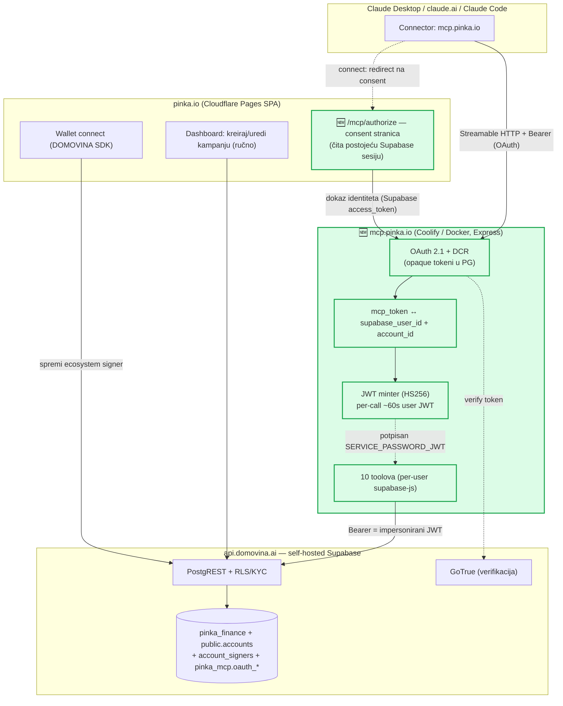
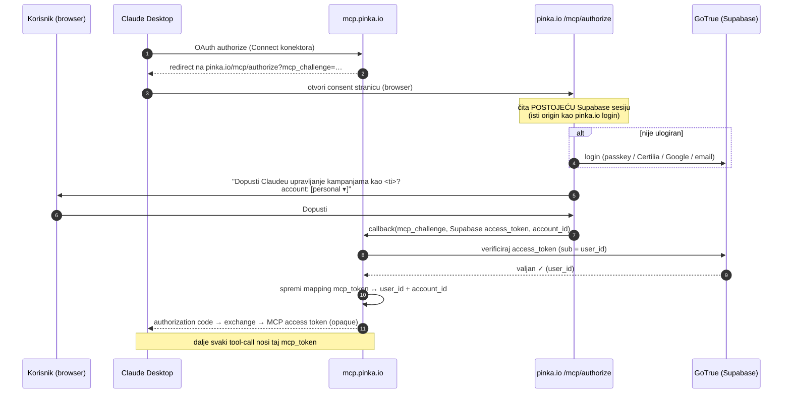
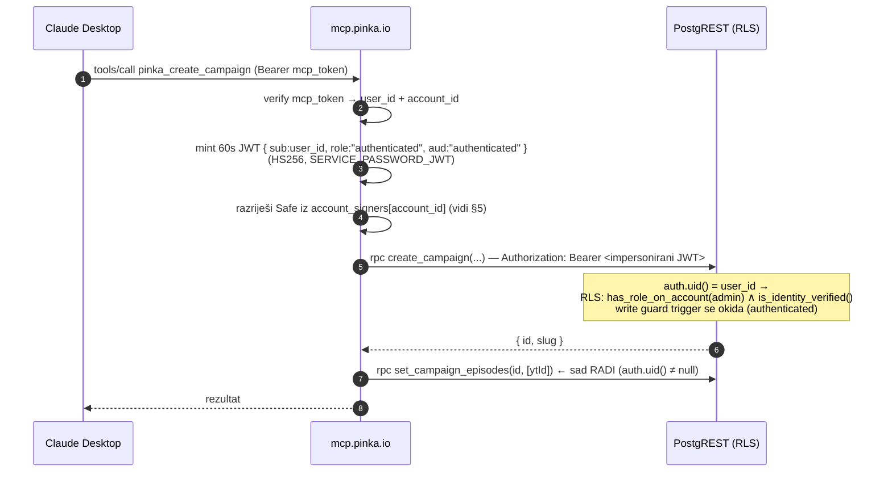
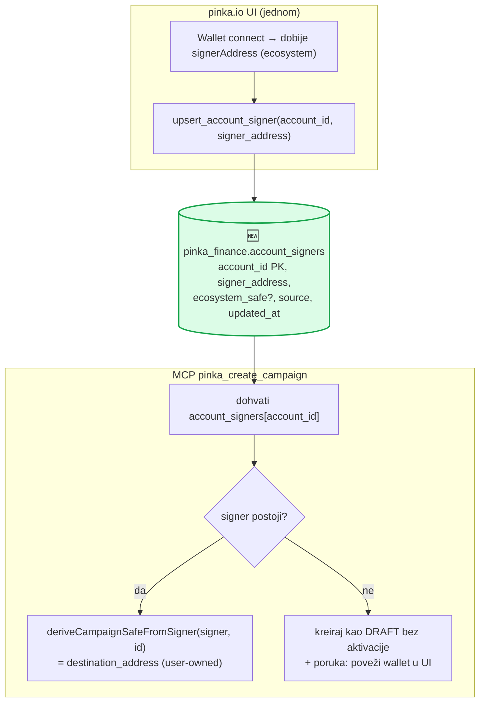
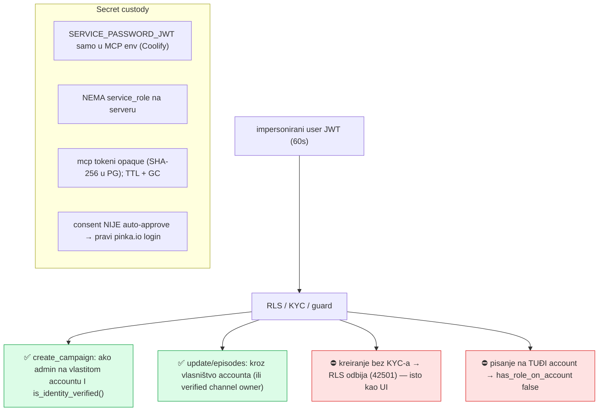
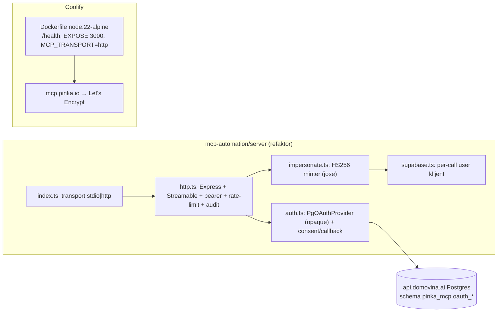

# `mcp.pinka.io` — remote, multi-user, deploy na Coolify (vizualni plan)

> **Vizija:** korisnik koji se autentificira na **pinka.io** istim credentialima može
> (a) ručno kroz pinka.io UI kreirati i administrirati kampanje, ILI (b) spojiti
> **mcp.pinka.io** na Claude Desktop i raditi to programski — **na istom identitetu,
> kroz iste RLS/KYC zaštite**. Deploy na **Coolify**, kao `mcp.domovina.ai`.
>
> Status: **dizajn (potvrđene ključne odluke), čeka implementaciju.** Datum: 2026-06-26.
> Nadograđuje [`mcp-pinka-implementation-plan.md`](mcp-pinka-implementation-plan.md)
> (v0: lokalni stdio + service_role) i ostvaruje "ciljni model" iz
> [`auth-design.md`](auth-design.md) (impersonirani Supabase JWT).

---

## 1. Od v0 (lokalni) do v1 (remote) — što se mijenja

| | v0 (sagrađeno: `server/`) | v1 (ovaj plan) |
|---|---|---|
| Transport | lokalni **stdio** | remote **Streamable HTTP** (Express) |
| Host | tvoj laptop | **Coolify** (Docker), `mcp.pinka.io` |
| Auth | `service_role` (god-mode) | **OAuth 2.1 consent → impersonirani user JWT** |
| Identitet | hardkodiran `PINKA_ACCOUNT_ID` | **iz tvoje pinka.io prijave** (auth.uid()) |
| RLS/KYC | zaobiđeno | **nativno se primjenjuje** (kao u UI-u) |
| Tko može | samo ti, lokalno | **bilo koji ulogirani+KYC pinka.io korisnik** |
| Episode linking | direktni `campaign_subjects` write | **pravi DEFINER RPC-evi** (auth.uid() sad postoji) |
| Write guard | klijentski mirror | **pravi trigger radi** (auth.role()='authenticated') |
| Safe signer | env signer / default | **per-account ecosystem signer** iz baze |

**Velika sigurnosna pobjeda:** v1 **nema `service_role`** na serveru. Sve ide kroz
identitet korisnika; MCP ne može ništa što korisnik ne bi mogao i sam u UI-u.

> v0 ostaje koristan kao lokalni dev/solo alat; v1 je produkcijski multi-user put.
> Codebase se refaktorira da podržava **oba transporta** (kao `domovina-rag/services/mcp`).

---

## 2. Arhitektura (komponente)

---

## 3. Connect flow (jednokratno, kod spajanja konektora)

Cilj: utvrditi identitet JEDNOM, bez novog logina (korisnik je već ulogiran na
pinka.io), pa mapirati `mcp_token ↔ supabase_user_id`.

---

## 4. Per-call impersonacija (svaki tool poziv)

**Posljedice (vs v0):** episode-linking koristi prave DEFINER RPC-eve; write guard
trigger stvarno radi (nema klijentskog mirrora); KYC i admin-role se provjeravaju
serverski. MCP ne može pisati na tuđi account ni bez KYC-a — isto kao UI.

---

## 5. Safe = per-account ecosystem signer (UI/MCP zamjenjivost)

Per-campaign Safe se derivira iz **stabilnog ecosystem signera korisnika**. Taj 0x se
spremi kad korisnik poveže DOMOVINA wallet u pinka.io UI; MCP ga čita i derivira bez
browsera/passkey.

**Backend dodatak (mala migracija):** `pinka_finance.account_signers` + RPC
`upsert_account_signer(p_signer_address)` (SECURITY DEFINER; piše za `auth.uid()`-ov
account) + read grant. pinka.io wallet-connect zove RPC. Time su UI i MCP **potpuno
zamjenjivi** — oba deriviraju isti Safe iz istog signera.

---

## 6. Sigurnosni / autorizacijski model

- **JWT secret** je root-of-trust cijelog Supabasea i ionako živi na istoj Coolify
  infri; na MCP-u: kratki TTL, per-call mint, nikad u log. Rotabilan.
- **Blast-radius manji nego v0**: nema god-mode service_role ključa; sve je gated
  korisnikovim identitetom i KYC-om.
- **Scope** `pinka:write`, per-user **rate-limit** i **audit** (reuse domovina obrazac).

---

## 7. OAuth state + deploy (Coolify, uzor `mcp.domovina.ai`)

- **OAuth tablice**: port `domovina-rag/infra/postgres/migrations/001_oauth_tables.sql`
  u **schema `pinka_mcp`** na **istom** Supabase Postgresu (raw `pg` Pool; odvojeno od
  PostgREST app puta). Jedna baza, manje pokretnih dijelova.
- **Dockerfile + Coolify**: 1:1 obrazac iz `docs/coolify-mcp-application.md` (Dockerfile
  buildpack, base dir `/server`, attach na Supabase/coolify network, env u UI, domena
  `mcp.pinka.io`, healthcheck `/health`).
- **Env (v1)**: `MCP_TRANSPORT=http`, `MCP_PORT`, `MCP_PUBLIC_BASE_URL=https://mcp.pinka.io`,
  `MCP_OAUTH_PG_URL` (Supabase Postgres), `SUPABASE_URL`, `SUPABASE_JWT_SECRET`
  (=SERVICE_PASSWORD_JWT), `SUPABASE_ANON_KEY`, `PINKA_CONSENT_URL=https://pinka.io/mcp/authorize`,
  rate-limit + GC varijable. **Bez** `SUPABASE_SERVICE_ROLE_KEY`.

---

## 8. Toolovi (v1 promjene vs v0)

| Tool | Promjena u v1 |
|---|---|
| **(novo)** `pinka_whoami` | prikaže spojeni identitet: user, account, KYC status, ima li ecosystem signer |
| `pinka_create_campaign` | account iz JWT identiteta (ne env); Safe iz `account_signers`; RLS/KYC nativno; bez ručnog metadata.safe hacka |
| `pinka_update_campaign` | bez guard-mirrora (pravi trigger radi); i dalje defenzivne provjere |
| `pinka_set_episodes` / attach / detach | **pravi DEFINER RPC-evi** (`set_campaign_episodes`, …) umjesto direktnog writea |
| `pinka_list_campaigns` | default filter = tvoj account (iz identiteta), ne env |
| ostali (`get`, `import_domovina`, `derive_safe`, `list_contributions`) | logika ista; klijent = per-user |

Sva tool **logika i validacija** (`lib/campaign-config.ts`, `lib/domovina-import.ts`,
`lib/chain/safe.ts`) se **reusa iz v0** netaknuta.

---

## 9. Plan izvedbe (faze)

1. **Backend (domovina-api migracija):** `pinka_finance.account_signers` + RPC
   `upsert_account_signer` + read grant. (KYC/RLS/account model već postoje.)
2. **pinka.io UI:** (a) wallet-connect zove `upsert_account_signer`; (b) nova ruta
   `/mcp/authorize` — consent stranica (čita Supabase sesiju, bira account, šalje dokaz MCP-u).
3. **MCP auth jezgra:** OAuth PG store (`pinka_mcp.oauth_*`), `PgOAuthProvider`
   (port iz domovina), custom **consent/callback** (NE auto-approve), `impersonate.ts` (jose HS256), per-call user klijent.
4. **HTTP transport:** Express + Streamable HTTP + bearer + rate-limit + audit (port iz domovina), `index.ts` bira `stdio|http`.
5. **Toolovi refaktor:** per-user klijent, account iz identiteta, pravi episode RPC-evi, Safe iz `account_signers`, `pinka_whoami`.
6. **Dockerfile + Coolify:** image, env, network, domena `mcp.pinka.io`, DNS, healthcheck, deploy.
7. **E2E:** spoji konektor iz Claude Desktopa kao stvarni KYC-ani korisnik → kreiraj+aktiviraj kampanju → potvrdi karticu na domovina.ai; provjeri da ne-KYC korisnik biva odbijen.

---

## 10. Otvorena pitanja za kasnije (ne blokiraju početak)

- **Account izbor** kad korisnik ima više identiteta/accounta (poznata zamka) — consent
  stranica nudi padajući izbornik; default personal account ulogiranog usera.
- **A2A skill** `create_project` povrh istog (dijeli auth) — odgođeno (vidi `mcp-a2a-design.md`).
- **Rotacija JWT secreta** — uskladiti s domovina-api rotacijom.

---

### Sažetak odluke

Remote **Streamable HTTP** MCP na **Coolify** (`mcp.pinka.io`), **bez service_role**.
OAuth consent na **pinka.io** (postojeća sesija) → mapping na Supabase user → per-call
**impersonirani 60s JWT** → writeovi kroz **RLS/KYC** nativno. Safe se derivira iz
**per-account ecosystem signera** (UI ga puni, MCP čita) → UI i MCP **potpuno
zamjenjivi**. Sva v0 tool-logika se reusa; novi su samo auth/transport/deploy sloj +
mala `account_signers` migracija.
